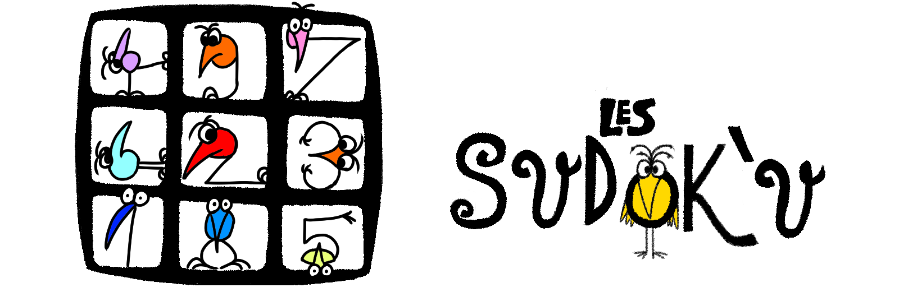
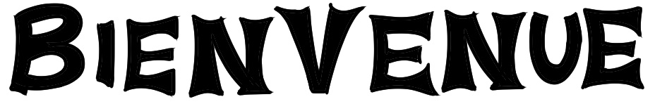

# Site Web et intégration SAE
-----------------

## Présentation rapide du site
**L'ensemble du code a été ecrit par Damien Brunstein et Thomas Rott.**

Le site contient des images (screenshots ou images).

Ceci est le logo de notre site. (creer par Damien)

Ceci est un exemple de titre pour les sections de notre site.

C'est l'ensemble des titres de sections qui ont été creer par Damien.

Ce n'est seulement les images des sites qui sont des screenshots.

Les autres ont étés récuperer sur Internet.

#### Presentation des sections

1. bienvenue ( acceuil )
2. histoire du sudoku
3. régles du jeu
4. grilles exemple
5. sites pour jouer
6. les autres proposition de jeu

-----------------
## Intégration du code depuis le C sharp

**Le code est ecrit par le c# depuis un template du code html et les grilles sont placer dans le code par celui-ci.**

Pour facilite le code, le css pour le formatage entre les differentes tailles de grilles est près écrit.

Le dll gére aussi la lecture du fichier .csv qui contient la/les grille(s) de sudoku à résoudre.
